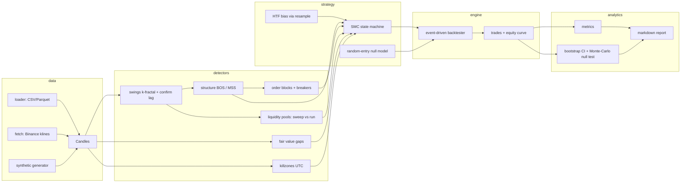

# ict-backtest

A rigorous implementation of the **Smart Money Concepts / Inner Circle Trader (ICT)**
framework, paired with a backtesting harness built to answer one question honestly:

> **Do these strategies actually have edge, or do they just look good on charts?**

Every design decision serves that goal. The detectors are faithful to the ICT
definitions (order blocks, fair value gaps, liquidity sweeps, market structure,
OTE, killzones), and the harness is engineered so that a positive result cannot
be an artifact of lookahead bias, intrabar wishful thinking, or ignored costs.

---

## Architecture



**Package layout** (`src/ict_backtest/`):

| Module | Responsibility |
|---|---|
| `core.py` | `Candles` container, artifact dataclasses, ATR, timeframe resampling |
| `detectors/` | one module per SMC primitive, all vectorized, all confirm-indexed |
| `strategy/` | the composed ICT "2022 model" state machine + null baselines, TOML config |
| `engine/` | order/fill/position engine with pessimistic intrabar rules and a cost model |
| `analytics/` | performance metrics, bootstrap CIs, random-baseline p-values, reports |
| `data/` | loaders, Binance fetcher, synthetic regime-switching generator |

## The strategy (canonical ICT flow)

1. **Bias** — higher-timeframe structure direction (last 4h BOS/MSS), mapped to
   base bars through HTF-bar-close confirm indices.
2. **Sweep** — a liquidity pool *against* the bias gets purged and price closes
   back inside (stop hunt / turtle soup). Sell-side sweep arms a long.
3. **Shift** — a base-timeframe structure break in the bias direction within
   `sweep_to_mss_bars` confirms displacement.
4. **Retrace entry** — limit order at the FVG (or order block) left by the
   displacement leg, required to sit in the OTE band (62–79% retracement) on
   the discount/premium side, inside a killzone.
5. **Risk** — stop beyond the sweep wick + ATR buffer; target the nearest
   opposing liquidity pool offering ≥ `min_rr`, else a fixed R multiple;
   fixed-fractional sizing.

Every knob lives in [`configs/default.toml`](configs/default.toml).

## Why you can trust the numbers

- **Confirm-index discipline.** Every artifact carries the bar index at whose
  close it becomes knowable (a k-fractal swing at bar *p* is only visible at
  *p + k*; an HTF event only after the HTF bar completes). Strategies cannot
  see anything earlier.
- **Prefix-consistency tests.** `tests/test_no_lookahead.py` runs the full
  strategy on `candles[:K]` and on the full series and asserts the order
  streams before bar K are *identical* — the gold-standard lookahead test.
  This caught a real bug during development: mutating a liquidity pool when a
  later equal-high merged into it rewrote history, so pool snapshots are
  append-only.
- **Pessimistic intrabar rules.** Orders fill no earlier than the bar after
  submission; if a bar touches both stop and target, the stop wins; a same-bar
  take-profit on the entry bar is never granted; gapped exits fill at the open,
  not at the level.
- **Costs on every fill.** Half-spread both ways, per-side commission, extra
  slippage on stop/market fills.
- **Null-model statistics.** A backtest is only called significant if it beats
  a Monte-Carlo distribution of random-entry strategies matched on trade
  frequency, holding period, direction mix, and killzone universe — which
  controls for market drift. Per-trade R also gets a bootstrap CI.

## Quickstart

```bash
uv sync --extra dev --extra fetch      # or: pip install -e ".[dev,fetch]"

# real data (needs network access to Binance's public API)
uv run ict-backtest fetch --symbol BTCUSDT --interval 15m --start 2023-01-01 --out data/btc_15m.parquet
uv run ict-backtest run --data data/btc_15m.parquet --config configs/default.toml --validate 200 --report reports/btc.md

# no network? synthetic data exercises the whole pipeline
uv run ict-backtest synth --bars 35040 --out data/synth.parquet
uv run ict-backtest run --data data/synth.parquet --validate 200

uv run pytest        # 38 tests, ~1s
```

Python API:

```python
from ict_backtest import Backtester, CostModel, SMCConfig, SMCStrategy
from ict_backtest.data import load_candles
from ict_backtest.analytics import compute_metrics, random_baseline_test

candles = load_candles("data/btc_15m.parquet")
bt = Backtester(cost=CostModel(spread_bps=1, commission_bps=2, slippage_bps=1))
result = bt.run(candles, SMCStrategy(candles, SMCConfig()))
print(compute_metrics(result))
print(random_baseline_test(candles, result, bt, n_sims=200))
```

## Included experiments (synthetic, reproducible)

Real-market endpoints are unreachable from the build environment, so the
committed reports use the synthetic generator — which doubles as a calibration
of the harness itself:

| Regime | Result | Interpretation |
|---|---|---|
| [Random walk](reports/synthetic_null.md) (no structure by construction) | 27 trades, −5.5%, p = 0.78 vs null | **Correct null behavior** — an honest harness finds nothing where nothing exists. A "profitable" result here would indicate leakage. |
| [Persistent trends](reports/synthetic_trending.md) | 12 trades, +8.4%, PF 2.19, p = 0.005 vs null | The pipeline **can** detect exploitable structure when it exists — the machinery discriminates. |

The verdict on real markets is deliberately left to real data: run the
`fetch` + `run --validate` commands above. The framework will tell you, with a
p-value, whether the SMC signal beats luck **after costs** — and the bootstrap
CI will tell you whether the trade sample is even large enough to say.

## Interpreting a run

- `Mean trade R` CI straddling zero → the sample is consistent with no edge,
  whatever the total return says.
- `p_value` ≥ 0.05 vs the random baseline → performance is explainable by
  drift + luck at that trade frequency.
- Re-run with `--intrabar-policy optimistic` to bound the intrabar ambiguity:
  the truth lies between the two policies; a strategy that only works under
  the optimistic one is an artifact.

## Extending (designed-for iteration points)

- **New setups**: add a detector returning confirm-indexed artifacts, compose
  it in a `Strategy.on_bar`; the engine and analytics are strategy-agnostic.
- **New markets**: any OHLCV CSV/Parquet loads; timeframe is inferred;
  annualization uses 24/7 by default (`analytics/metrics.py`).
- **Walk-forward / parameter sweeps**: `SMCConfig` is a flat dataclass —
  sweep fields and split date ranges via `load_candles(start=, end=)`.
- **Lower-timeframe fill resolution**: `Backtester._resolve_exits` is the
  single seam where 1m-data-driven intrabar resolution would plug in.
- Every extension inherits the no-lookahead guarantee for free if artifacts
  carry honest `confirm_index` values — and `test_no_lookahead.py` will catch
  you if they don't.

## Glossary mapping (report → code)

| ICT term | Code |
|---|---|
| Order Block / Breaker / Mitigation | `detectors/order_blocks.py` (`OrderBlock`, `is_breaker_at`) |
| Fair Value Gap / Imbalance | `detectors/fvg.py` (`FVG`, displacement filter) |
| Liquidity Pool / Sweep / Run / Stop Hunt | `detectors/liquidity.py` (`LiquidityPool.taken_kind`) |
| BOS / MSS / CHoCH | `detectors/structure.py` (`StructureEvent.kind`) |
| OTE (62–79% fib) | `strategy/smc.py::_stage_entry` |
| Premium/Discount | `require_discount` check in `_stage_entry` |
| Killzones / Silver Bullet | `detectors/killzones.py` |
| HTF bias / top-down | `strategy/smc.py::_compute_bias` |
