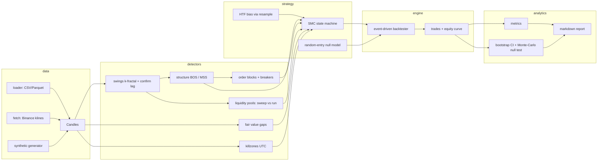

# ict-backtest

A rigorous implementation of the **Smart Money Concepts / Inner Circle Trader (ICT)**
framework, paired with a backtesting harness built to answer one question honestly:

> **Do these strategies actually have edge, or do they just look good on charts?**

Every design decision serves that goal. The detectors are faithful to the ICT
definitions (order blocks, fair value gaps, liquidity sweeps, market structure,
OTE, killzones), and the harness is engineered to reduce the principal known
sources of backtest deception: lookahead bias, intrabar wishful thinking, and
ignored costs. No finite harness rules out every artifact; this one makes the
known ones testable.

## ▶️ PROGRAM T OPEN (2026-07-06): diversified time-series momentum

The intraday programs all died to the same number — effects smaller
than the ~1.4 bp round trip. Program T moves to the strategy family
whose economics invert that ratio: **Moskowitz/Ooi/Pedersen time-series
momentum with volatility targeting, diversified across five GLBX
markets** (ES/CL/GC/ZN/6E dev; HG/ZF/6J/ZC sealed as the
instrument-axis holdout), holding weeks-to-months so costs are noise.
The deepest evidence base of any systematic strategy (JFE 2012, a
century of evidence, +27% SG Trend in 2022) *and* documented
post-2010 decay — both designed for. Evidence review:
[`docs/RESEARCH_T.md`](docs/RESEARCH_T.md). Binding protocol:
[`reports/PREREGISTRATION_T.md`](reports/PREREGISTRATION_T.md). Stage-1
tasking: [`reports/dev/T_ITER01_TASK.md`](reports/dev/T_ITER01_TASK.md).
New code: `analytics/trend_study.py` (signal battery + circular
shift-null), `strategy/tsmom.py` (vol-targeted TSMOM),
`analytics/portfolio.py` (multi-instrument aggregation), config in
[`configs/t1_trend.toml`](configs/t1_trend.toml) — tested, incl.
prefix-consistency no-lookahead proofs.

## 🛑 PROGRAM S CONCLUDED (2026-07-06): the published session anomalies are sub-costs residues on ES

A preregistered program built from *externally documented* edges rather
than trading folklore — market intraday momentum (Gao/Han/Li/Zhou JFE
2018; Baltussen/Da/Lammers/Martens JFE 2021), opening-range breakout,
pre-FOMC drift (Lucca & Moench JF 2015), IBS mean reversion — tested on
the burned 16-year ES sample (~4,000 sessions). **Stage-1 verdict: none
of the four support rules was met.** Every effect carries the
literature-predicted sign at +0.5–2 bp/day, every 95% CI straddles
zero, and the engine's ES round-trip cost (~1.4 bp) exceeds the largest
primary mean. The one positive full-sample cell (intraday momentum on
high-vol days, +2.0 bp) is exploratory, fails both temporal halves, and
fades post-2020. Per the stopping rule the program concluded at Stage 1;
the strategies were never run on real data and **NQ was never fetched**
(its re-consecration lapsed unused). Record:
[`docs/RESEARCH_S1.md`](docs/RESEARCH_S1.md) ·
[`reports/PREREGISTRATION_S.md`](reports/PREREGISTRATION_S.md) ·
[`reports/dev/S_ITER01.md`](reports/dev/S_ITER01.md) ·
[`reports/dev/S_ITER01_ADJUDICATION.md`](reports/dev/S_ITER01_ADJUDICATION.md).
The tested library code survives (`analytics/session_study.py`,
`strategy/sessions.py`) for future, separately preregistered programs.

## 🛑 SMC/ICT PROGRAM CONCLUDED (2026-07-03): four tests, one answer

The full program — canonical ICT (V1), maximum-faithfulness (V2.1,
retired), and the narrative engine on crypto and on 16 years of ES
futures (V3) — found **no positive edge anywhere, and consistent
sign-inversion where any signal existed** (higher mechanized SMC
conviction → lower forward return, monotone on ETH and ES). Full record:
[`reports/PROGRAM_CONCLUSION.md`](reports/PROGRAM_CONCLUSION.md). All
five holdout datasets remain sealed and unspent. The harness, the
statistics, and the replay UI survive for future, separately
preregistered programs.

## FINAL VERDICT (2026-07-01): V1 FAILED CONFIRMATION — concluded

The preregistered stopping rule has fired. The frozen specification
(`543ec12`) was run once on the untouched ETHUSDT holdout with 1m execution
resolution: **−12.9%, PF 0.87, mean R −0.18 (CI straddling zero), null
p = 0.53.** Combined with the original BTC failure (−34.5%; −5.6% at zero
costs; p = 1.0), the joint pass criterion is mathematically unreachable.

**This composition is closed: no deployment, no further tuning, no
re-testing.** Full record: [`reports/FINAL_VERDICT.md`](reports/FINAL_VERDICT.md)
and [`reports/VERDICT_btc15m_2023-2026.md`](reports/VERDICT_btc15m_2023-2026.md).
The harness remains reusable for new, separately preregistered hypotheses;
an ES/index-futures run would be exploratory only and cannot alter this
verdict.

---

## Architecture



**Package layout** (`src/ict_backtest/`):

| Module | Responsibility |
|---|---|
| `core.py` | `Candles` container, artifact dataclasses, ATR, timeframe resampling |
| `detectors/` | one module per SMC primitive, all vectorized, all confirm-indexed |
| `strategy/` | the composed ICT "2022 model" state machine + null baselines, TOML config |
| `engine/` | order/fill/position engine with pessimistic intrabar rules and a cost model |
| `analytics/` | performance metrics, bootstrap CIs, random-baseline p-values, reports |
| `data/` | loaders, Binance fetcher, synthetic regime-switching generator |

## The strategy (canonical ICT flow)

1. **Bias** — higher-timeframe structure direction (last 4h BOS/MSS), mapped to
   base bars through HTF-bar-close confirm indices.
2. **Sweep** — a liquidity pool *against* the bias gets purged and price closes
   back inside (stop hunt / turtle soup). Sell-side sweep arms a long.
3. **Shift** — a base-timeframe structure break in the bias direction within
   `sweep_to_mss_bars` confirms displacement.
4. **Retrace entry** — limit order at the FVG (or order block) left by the
   displacement leg, required to sit in the OTE band (62–79% retracement) on
   the discount/premium side, inside a killzone.
5. **Risk** — stop beyond the sweep wick + ATR buffer; target the nearest
   opposing liquidity pool offering ≥ `min_rr`, else a fixed R multiple;
   fixed-fractional sizing.

Every knob lives in [`configs/default.toml`](configs/default.toml).

## Why you can trust the numbers

- **Confirm-index discipline.** Every artifact carries the bar index at whose
  close it becomes knowable (a k-fractal swing at bar *p* is only visible at
  *p + k*; an HTF event only after the HTF bar completes). Strategies cannot
  see anything earlier.
- **Prefix-consistency tests.** `tests/test_no_lookahead.py` runs the full
  strategy on `candles[:K]` and on the full series and asserts the order
  streams before bar K are *identical* — the gold-standard lookahead test.
  This caught a real bug during development: mutating a liquidity pool when a
  later equal-high merged into it rewrote history, so pool snapshots are
  append-only.
- **Pessimistic intrabar rules.** Orders fill no earlier than the bar after
  submission; if a bar touches both stop and target, the stop wins; a same-bar
  take-profit on the entry bar is never granted; gapped exits fill at the open,
  not at the level.
- **Costs on every fill.** Half-spread both ways, per-side commission, extra
  slippage on stop/market fills.
- **Null-model statistics.** The primary control (`matched_baseline_test`)
  replays the strategy's *own trades* — side, stop/target geometry, risk
  sizing, trade count — at random times in the same killzone universe: entry
  timing is randomized while the approximate fractional risk geometry is
  retained. Execution type (market vs. the original limit fills) and realized
  exposure may differ, so matching diagnostics are printed next to the
  p-value, and mean per-trade R (risk-normalized, exposure-robust) is
  reported as a second test statistic. A simpler drift-only random-entry
  control remains available and is labeled descriptive. Mean trade R gets a
  **block bootstrap** CI (preserves regime clustering, unlike the IID
  bootstrap).

## Quickstart

```bash
uv sync --extra dev --extra fetch      # or: pip install -e ".[dev,fetch]"

# real data (needs network access to Binance's public API)
uv run ict-backtest fetch --symbol BTCUSDT --interval 15m --start 2023-01-01 --out data/btc_15m.parquet
uv run ict-backtest run --data data/btc_15m.parquet --config configs/default.toml --validate 200 --report reports/btc.md

# no network? synthetic data exercises the whole pipeline
uv run ict-backtest synth --bars 35040 --out data/synth.parquet
uv run ict-backtest run --data data/synth.parquet --validate 200

uv run pytest        # 48 tests, ~3s
```

Python API:

```python
from ict_backtest import Backtester, CostModel, SMCConfig, SMCStrategy
from ict_backtest.data import load_candles
from ict_backtest.analytics import compute_metrics, matched_baseline_test

candles = load_candles("data/btc_15m.parquet")
bt = Backtester(cost=CostModel(spread_bps=1, commission_bps=2, slippage_bps=1))
result = bt.run(candles, SMCStrategy(candles, SMCConfig()))
print(compute_metrics(result))
print(matched_baseline_test(candles, result, bt, n_sims=200))
```

## Included experiments (synthetic, reproducible)

Real-market endpoints are unreachable from the build environment, so the
committed reports use the synthetic generator — a calibration of the harness,
not evidence about markets (regenerated after the audit fixes, which made
entries stricter and rarer):

| Regime | Result | Interpretation |
|---|---|---|
| [Random walk](reports/synthetic_null.md) (no structure by construction) | 14 trades, +9.3%, p(return) = 0.050, p(mean R) = 0.085, R CI [−0.34, 1.30] | A borderline p on a lucky draw: the exposure-robust mean-R statistic weakens it and the **CI straddles zero** — read jointly, correctly rejected. One metric alone would have fooled you; that is why the report prints several. |
| [Persistent trends](reports/synthetic_trending.md) | 4 trades, +2.0%, p = 0.23 | Sample far too small to conclude anything — and the report says so instead of extrapolating. |

The real-market answer came from real data (see the verdict above): 174
trades over 3.5 years of BTCUSDT 15m, no gross edge, clearly negative after
costs.

## Interpreting a run

- `Mean trade R` CI straddling zero → the sample is consistent with no edge,
  whatever the total return says.
- `p_value` ≥ 0.05 vs the random baseline → performance is explainable by
  drift + luck at that trade frequency.
- Prefer `--intrabar-data <1m file>` to resolve ambiguous bars by observed
  touch order. Without it, re-run with `--intrabar-policy optimistic` to
  bound the ambiguity: the truth lies between the two policies; a strategy
  that only works under the optimistic one is an artifact.

## Roadmap (post-verdict decision rule)

The BTC 2023–2026 sample is observed and off-limits for tuning. The agreed
sequence, in order:

1. ~~Matched, risk-geometry-preserving null with diagnostics~~ — done
   (estimand qualified; mean-R second statistic added after re-audit).
2. ~~Block bootstrap for dependence-aware CIs~~ — done.
3. ~~OB lifecycle filtering in POI selection + stale-order cancellation~~ — done.
4. ~~1m-data intrabar resolution~~ — done: pass `--intrabar-data 1m.parquet`
   (or `Backtester(intrabar=...)`) and ambiguous bars resolve by observed
   sub-bar touch order; the policy only breaks ties within a single sub-bar
   or where coverage is missing. This collapses the conservative/optimistic
   spread (12 ambiguous trades flipped the BTC result by ~$36k of PnL).
5. ~~Freeze the specification, then one confirmatory run on untouched
   data~~ — done: spec frozen at `543ec12`, preregistered ETHUSDT holdout
   run once with 1m resolution. **Negative and inconclusive.**
6. ~~If still negative or indistinguishable from zero: stop~~ — **stopped.**
   The stopping rule fired on 2026-07-01; see
   [`reports/FINAL_VERDICT.md`](reports/FINAL_VERDICT.md). That is a
   finished research result, not a failure of the tooling.

## Study V2: maximum-faithfulness variant (open, preregistered)

V1's verdict binds the *canonical* composition. Study V2 adds the remaining
major teachings and is preregistered as a **new** study
([`reports/PREREGISTRATION_V2.md`](reports/PREREGISTRATION_V2.md), frozen
config [`configs/v2_faithful.toml`](configs/v2_faithful.toml)):

- **Inversion FVGs (IFVG)** — a gap the displacement leg *closes through*
  flips polarity and becomes the first-priority entry zone on the retest
  (`FVG.invert_index` / `invert_fail_index`, POI kind `"ifvg"`).
- **DST-correct killzones** — canonical New-York-time windows (London
  02–05, NY 07–09, Silver Bullet 10–11 ET) evaluated through
  `America/New_York`, not fixed-UTC approximations.
- **News blackout** — no signals 30 min before / 60 min after high-impact
  releases; built-in NFP first-Friday + Fed-published FOMC calendar
  2023–2026, CSV override for full calendars (`data/news.py`).
- **Retest-confirmation entries** — instead of a resting limit, wait for
  price to trade into the zone *and close back on the right side*, then
  enter at market (the brief's "wait for the confirming close" rule).
- **Breakeven management** — stop moves to entry at +1R; R accounting
  stays anchored to the initial stop.

**Amendment V2.1** (declared before any holdout contact) makes the HTF
judgment layer the *majority contributor*, per ICT's own framing — the
mechanics above are triggers only, subordinate to four bias-dominance
gates that must all agree at signal time:

- **Dual-timeframe agreement** — daily structure direction must confirm
  the 4h bias (`bias_htf2_multiplier = 96`).
- **HTF premium/discount** — longs only below the HTF dealing-range
  equilibrium, shorts only above (`require_htf_discount`).
- **Draw on liquidity** — an untaken HTF pool must exist beyond price in
  the trade direction as the magnet the market reaches for (`require_draw`).
- **No-news days** — the entire ET calendar day of any NFP/FOMC event is
  excluded, the strict reading of "only trade days with no news"
  (`news_day_blackout`).

Holdouts (untouched): SOLUSDT 2023–2026 and BTCUSDT 2019–2022, 15m + 1m,
run once each at the frozen commit. Decision rule is declared in the
preregistration; a fail closes the mechanical-ICT program here.

## Study V3 "Origin": the narrative engine (development phase)

V3 pivots from testing ICT's composition to **originating our own
mechanization of HTF judgment** — the "which way is the market going"
layer that ICT treats as the majority contributor. Instead of a single
structure veto, `strategy/narrative.py` aggregates a weighted vote of
four codified narrative factors (per daily/4h bar, close-visible only):

| Factor | Codifies |
|---|---|
| `struct_mtf` | 4h structure direction (last BOS/MSS) |
| `struct_htf` | daily structure direction |
| `struct_wk` | weekly structure direction — the highest timeframe with enough bars to confirm swings on a multi-year sample |
| `dol` | draw on liquidity: untaken daily pools + unfilled daily FVGs above vs. below price |
| `ipda` | IPDA **20/40/60-day** data-range events (ICT's stated stand-in for weekly/monthly context): close-break = continuation, sweep-and-recover = reversal; the three windows vote, so cross-horizon agreement scales conviction |

Why not monthly candles: ~42 monthly bars in a 3.5-year sample yield a
handful of structure events confirming months late — statistically the
factor would just re-measure drift, which the null already controls for.
The 60-day IPDA range carries the monthly-scale context in testable form.

A conviction threshold enforces *no narrative, no trade* (`bias_mode =
"narrative"`, `narrative_min_conviction`). The ICT trigger stack
(sweep → MSS → IFVG/FVG/OB retest confirmation) rides underneath,
unchanged.

Protocol ([`reports/PREREGISTRATION_V3.md`](reports/PREREGISTRATION_V3.md)):
development and tuning happen **only on the burned sets** (BTC/ETH
2023–2026 — already worthless as confirmation, so legitimately
in-sample); the untouched holdouts are BNBUSDT 2023–2026 and ETHUSDT
2019–2022, one shot each after the freeze. SOL 2023–2026 and BTC
2019–2022 stay reserved for V2.1.

## Testing on index futures / equities (ES, SPY, other high-liquidity markets)

ICT's own teaching centers on ES/NQ futures and FX, so index markets are
arguably the *more* faithful venue — and the harness is instrument-agnostic.
What to know:

- **Data**: the bundled fetcher is Binance-only. For ES/SPY bring your own
  OHLCV CSV/Parquet (broker export, Databento, FirstRate, Polygon, …); the
  loader maps common column names and infers the timeframe. Supply both the
  trading timeframe and 1m files (`--intrabar-data`) — incomplete 1m buckets
  automatically fall back to the conservative policy.
- **Costs**: recalibrate `--spread-bps/--commission-bps` per instrument. ES
  is far cheaper than crypto (one 0.25 tick ≈ 0.4 bps at 6000); SPY tighter
  still. Cheap costs cut both ways: they help a marginal edge but remove the
  "costs ate it" excuse.
- **Sessions**: killzones are fixed UTC windows without DST handling; for
  NY-centric instruments check the offsets for your test period (or trade
  `use_killzones = false` and treat time-of-day as an ablation).
- **Annualization**: pass `--bars-per-year` for session-bound data (RTH 15m
  US equities ≈ 26 x 252 = 6552), otherwise Sharpe/CAGR annualize against
  hours the market never traded. Overnight/weekend gaps are already handled
  pessimistically by the engine (exits fill at the gapped open).
- **Preregistration still applies**: an ES/SPY run counts as a holdout only
  if the spec is frozen before the data is touched, and it is run once.

## Extending (designed-for iteration points)

- **New setups**: add a detector returning confirm-indexed artifacts, compose
  it in a `Strategy.on_bar`; the engine and analytics are strategy-agnostic.
- **New markets**: any OHLCV CSV/Parquet loads; timeframe is inferred;
  annualization uses 24/7 by default (`analytics/metrics.py`).
- **Walk-forward / parameter sweeps**: `SMCConfig` is a flat dataclass —
  sweep fields and split date ranges via `load_candles(start=, end=)`.
- **Lower-timeframe fill resolution**: built in — pass finer candles via
  `Backtester(intrabar=...)`; `_resolve_exits`/`_entry_bar_touch_ib` walk the
  sub-bars, falling back to the declared policy where coverage is missing.
- Every extension inherits the no-lookahead guarantee for free if artifacts
  carry honest `confirm_index` values — and `test_no_lookahead.py` will catch
  you if they don't.

## Glossary mapping (report → code)

| ICT term | Code |
|---|---|
| Order Block / Breaker / Mitigation | `detectors/order_blocks.py` (`OrderBlock`, `is_breaker_at`) |
| Fair Value Gap / Imbalance | `detectors/fvg.py` (`FVG`, displacement filter) |
| Liquidity Pool / Sweep / Run / Stop Hunt | `detectors/liquidity.py` (`LiquidityPool.taken_kind`) |
| BOS / MSS / CHoCH | `detectors/structure.py` (`StructureEvent.kind`) |
| OTE (62–79% fib) | `strategy/smc.py::_stage_entry` |
| Premium/Discount | `require_discount` check in `_stage_entry` |
| Killzones / Silver Bullet | `detectors/killzones.py` |
| HTF bias / top-down | `strategy/smc.py::_compute_bias` |
